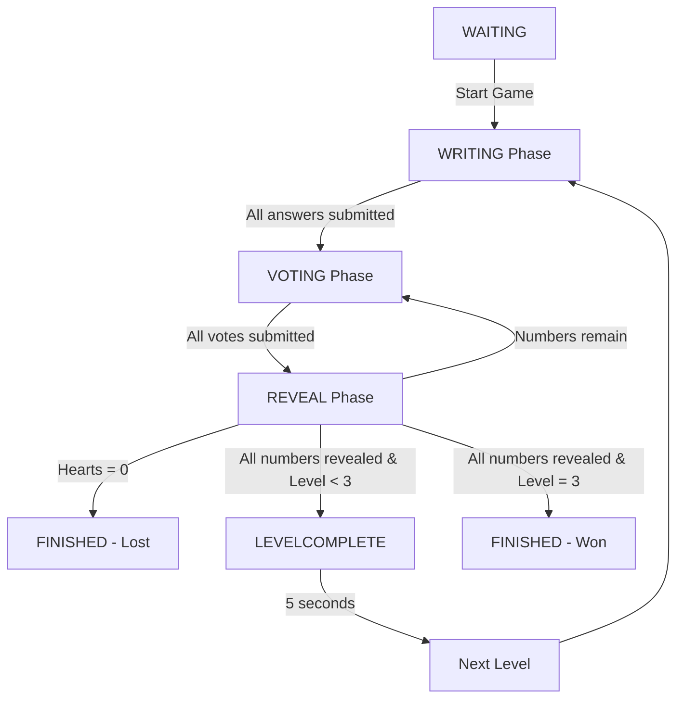

# 🎮 ITO Game - Documentation

> **เกมความสามัคคี** - เรียงลำดับตัวเลข 1-100 โดยการสื่อสารผ่านคำใบ้

---

## 📚 Table of Contents

- [Game Overview](#game-overview)
- [Game Rules](#game-rules)
- [Architecture](#architecture)
- [Code Structure](#code-structure)
- [API Endpoints](#api-endpoints)
- [Database Schema](#database-schema)
- [Game Flow](#game-flow)
- [Components](#components)
- [Recent Updates](#recent-updates)
- [Development Guide](#development-guide)

---

## 🎯 Game Overview

**ITO (イト)** เป็นเกมความสามัคคีที่ผู้เล่นต้องร่วมมือกันเรียงลำดับตัวเลข 1-100 โดยไม่สามารถบอกตัวเลขโดยตรง แต่ต้องใช้**คำใบ้**ในการสื่อสาร

### Core Concept
- ผู้เล่นแต่ละคนได้รับ**เลขลับ** (1-100)
- ให้**คำใบ้**ที่สื่อถึงขนาดของเลข (เช่น โจทย์: "สัตว์เลี้ยงยอดนิยม" → คำใบ้: "แมว" = 50)
- ผู้เล่นทุกคน**โหวต**เลือกคำใบ้ที่คิดว่าสื่อถึงเลขที่**น้อยที่สุด**
- เปิดเผยเลข → ถ้าถูกต้อง ดำเนินต่อ / ถ้าผิด เสียหัวใจ

---

## 📖 Game Rules

### 🎲 Game Structure

| Element | Description |
|---------|-------------|
| **Players** | 2+ ผู้เล่น |
| **Levels** | 3 รอบ (Level 1, 2, 3) |
| **Numbers per Level** | Level 1: 1 เลข/คน, Level 2: 2 เลข/คน, Level 3: 3 เลข/คน |
| **Hearts** | เริ่มต้น 3 หัวใจ (สะสมตลอดทั้งเกม) |
| **Win Condition** | ผ่านทุก level โดยหัวใจเหลืออย่างน้อย 1 |
| **Lose Condition** | หัวใจหมด (0/3) |

### 🎮 Game Phases

```
┌─────────────────────────────────────────────────────┐
│  1. WAITING    → รอเริ่มเกม                          │
├─────────────────────────────────────────────────────┤
│  2. WRITING    → พิมพ์คำใบ้ (10 นาที)                │
│     - ผู้เล่นแต่ละคนพิมพ์คำใบ้สำหรับเลขของตัวเอง      │
│     - เมื่อทุกคนส่งครบ → ไป VOTING                    │
├─────────────────────────────────────────────────────┤
│  3. VOTING     → โหวตเลือกคำใบ้ (10 นาที)            │
│     - แสดงคำใบ้ทั้งหมด (ยกเว้นที่เปิดแล้ว)           │
│     - ผู้เล่นโหวตเลือกคำใบ้ที่น้อยที่สุด               │
│     - เมื่อทุกคนโหวต → ไป REVEAL                      │
├─────────────────────────────────────────────────────┤
│  4. REVEAL     → เปิดเผยผล (5 วินาที)                │
│     - แสดงคำใบ้ที่ได้คะแนนสูงสุด                      │
│     - เปิดเผยเลข + ตรวจสอบถูก/ผิด                     │
│     - ✅ ถูก = ไม่เสียหัวใจ                           │
│     - ❌ ผิด = เสียหัวใจตามจำนวนเลขที่ข้าม             │
│     - Auto-transition:                              │
│       • หัวใจหมด → FINISHED (แพ้)                     │
│       • เปิดครบทุกเลข → LEVELCOMPLETE / FINISHED     │
│       • ยังมีเลขเหลือ → VOTING (รอบต่อไป)             │
├─────────────────────────────────────────────────────┤
│  5. LEVELCOMPLETE → จบรอบ (5 วินาที)                 │
│     - แสดงความยินดี                                  │
│     - แสดงหัวใจคงเหลือ                                │
│     - Auto-transition → เริ่ม Level ถัดไป            │
├─────────────────────────────────────────────────────┤
│  6. FINISHED   → จบเกม                               │
│     - แสดงผลชนะ/แพ้                                  │
│     - สรุปสถิติ                                      │
└─────────────────────────────────────────────────────┘
```

### 🎯 Scoring Logic

#### การเปิดเลข (Reveal Logic)
```typescript
// ตัวอย่าง: มีเลข [1, 2, 3, 4, 5, 6]
// ผู้เล่นโหวต: 3

// Backend จะเปิด:
numbersToReveal = [1, 2, 3] // ทุกเลขที่ ≤ 3

// การคำนวณหัวใจ:
skippedNumbers = [1, 2]     // เลขที่น้อยกว่า 3
heartsLost = 2              // เสีย 2 หัวใจ
newHearts = 3 - 2 = 1       // เหลือ 1 หัวใจ

// รอบต่อไป:
unrevealedNumbers = [4, 5, 6] // เหลือ 3 ตัว
```

#### ตัวอย่างเพิ่มเติม

**Case 1: โหวตถูก**
```
เลข: [10, 20, 30, 40]
โหวต: 10 ✅

Result:
- เปิด: [10]
- เสียหัวใจ: 0
- รอบต่อไป: [20, 30, 40]
```

**Case 2: โหวตผิด**
```
เลข: [5, 15, 25, 35]
โหวต: 25 ❌

Result:
- เปิด: [5, 15, 25]
- ข้าม: [5, 15]
- เสียหัวใจ: 2
- รอบต่อไป: [35] → เปิดอัตโนมัติ
```

**Case 3: โหวตผิดมาก (Game Over)**
```
เลข: [1, 2, 3, 4]
หัวใจเหลือ: 3
โหวต: 4 ❌

Result:
- เปิด: [1, 2, 3, 4]
- ข้าม: [1, 2, 3]
- เสียหัวใจ: 3
- หัวใจเหลือ: 0
- สถานะ: FINISHED (แพ้) 💔
```

---

## 🏗️ Architecture

### High-Level Overview

```
┌─────────────────────────────────────────────────────┐
│                    CLIENT                           │
│  ┌──────────────────────────────────────────────┐   │
│  │  ItoGame.tsx (Main Component)                │   │
│  │  ├─ useItoGame (Firestore Realtime)         │   │
│  │  ├─ useVotes (Firestore Realtime)           │   │
│  │  └─ Child Components:                        │   │
│  │     ├─ ItoGameHeader                         │   │
│  │     ├─ ItoQuestionCard                       │   │
│  │     ├─ ItoMyNumbers                          │   │
│  │     ├─ ItoRevealedNumbers                    │   │
│  │     ├─ ItoWritingPhase                       │   │
│  │     ├─ ItoVotingPhase                        │   │
│  │     ├─ ItoRevealPhase                        │   │
│  │     ├─ ItoLevelComplete                      │   │
│  │     └─ ItoGameFinished                       │   │
│  └──────────────────────────────────────────────┘   │
└─────────────────────────────────────────────────────┘
                         │
                         ▼
┌─────────────────────────────────────────────────────┐
│                    API ROUTES                       │
│  /api/games/ito/[sessionId]/                        │
│  ├─ reveal (POST)     → เปิดเผยผลโหวต               │
│  └─ nextLevel (POST)  → เริ่ม Level ถัดไป           │
└─────────────────────────────────────────────────────┘
                         │
                         ▼
┌─────────────────────────────────────────────────────┐
│              FIREBASE FUNCTIONS                     │
│  src/lib/firebase/ito.ts                            │
│  ├─ initializeItoGame()     → สร้างเกม Level 1     │
│  ├─ startNextLevel()        → เริ่ม Level 2-3      │
│  ├─ submitPlayerAnswer()    → บันทึกคำใบ้           │
│  ├─ checkAllAnswersSubmitted() → เช็คพร้อมโหวต     │
│  ├─ startVotingPhase()      → เริ่ม Voting         │
│  ├─ submitVote()            → บันทึกการโหวต         │
│  ├─ countVotes()            → นับคะแนน             │
│  └─ revealAndCheck()        → เปิดเผย + ตรวจสอบ     │
└─────────────────────────────────────────────────────┘
                         │
                         ▼
┌─────────────────────────────────────────────────────┐
│                  FIRESTORE                          │
│  ┌────────────────────────────────────────────┐     │
│  │  game_sessions/{sessionId}                 │     │
│  │  ├─ currentLevel, totalLevels              │     │
│  │  ├─ hearts, currentRound, totalRounds      │     │
│  │  ├─ phase, questionText, revealedNumbers   │     │
│  │  │                                          │     │
│  │  ├─ player_answers (subcollection)         │     │
│  │  │  └─ {playerId}_{answerIndex}            │     │
│  │  │     ├─ number, answer, submittedAt      │     │
│  │  │     └─ isRevealed, answerIndex          │     │
│  │  │                                          │     │
│  │  └─ votes (subcollection)                  │     │
│  │     └─ {playerId}                           │     │
│  │        ├─ votedForPlayerId                  │     │
│  │        └─ votedForAnswerIndex               │     │
│  └────────────────────────────────────────────┘     │
└─────────────────────────────────────────────────────┘
```

---

## 📂 Code Structure

```
src/
├── app/api/games/ito/[sessionId]/
│   ├── reveal/route.ts          # เปิดเผยผลโหวต
│   └── nextLevel/route.ts       # เริ่ม Level ถัดไป
│
├── components/games/
│   ├── ItoGame.tsx              # Main Component (Logic Hub)
│   └── ito/                     # Subcomponents
│       ├── ItoGameHeader.tsx          # หัวเกม (หัวใจ, เวลา)
│       ├── ItoQuestionCard.tsx        # โจทย์
│       ├── ItoMyNumbers.tsx           # เลขของตัวเอง
│       ├── ItoRevealedNumbers.tsx     # ประวัติเลขที่เปิด
│       ├── ItoWritingPhase.tsx        # Phase: Writing
│       ├── ItoVotingPhase.tsx         # Phase: Voting
│       ├── ItoRevealPhase.tsx         # Phase: Reveal
│       ├── ItoLevelComplete.tsx       # Phase: Level Complete
│       └── ItoGameFinished.tsx        # Phase: Finished
│
├── lib/
│   ├── firebase/
│   │   └── ito.ts               # Game Logic Functions
│   └── hooks/
│       ├── useItoGame.ts        # Realtime Game State
│       └── useVotes.ts          # Realtime Votes
│
└── types/
    └── ito.ts                   # TypeScript Types
```

---

## 🔌 API Endpoints

### 1. POST `/api/games/ito/[sessionId]/reveal`

**Description:** เปิดเผยผลการโหวต

**Request:**
```typescript
// No body required
```

**Response:**
```typescript
{
  success: boolean;
  number: number;          // เลขที่เปิด
  isCorrect: boolean;      // ถูกหรือผิด
  heartsLost: number;      // หัวใจที่เสีย
  newHearts: number;       // หัวใจที่เหลือ
}
```

**Flow:**
1. นับคะแนนโหวต (`countVotes`)
2. หาคำใบ้ที่ชนะ
3. เปิดเผยและตรวจสอบ (`revealAndCheck`)
4. อัปเดต game state และ player answers

### 2. POST `/api/games/ito/[sessionId]/nextLevel`

**Description:** เริ่ม Level ถัดไป

**Request:**
```typescript
// No body required
```

**Response:**
```typescript
{
  success: boolean;
  error?: string;
}
```

**Flow:**
1. เช็คว่าสามารถเริ่ม level ถัดไปได้ (`currentLevel < totalLevels`)
2. เรียก `startNextLevel` สร้าง level ใหม่
3. สุ่มโจทย์ + เลขใหม่
4. ลบ player_answers และ votes เก่า
5. สร้าง player_answers ใหม่

---

## 💾 Database Schema

### Collection: `game_sessions/{sessionId}`

```typescript
interface ItoGameState {
  id: string;
  roomId: string;
  gameId: string;           // "BWLxJkh45e6RiALRBmcl"

  // Level Progress
  currentLevel: number;     // 1-3
  totalLevels: number;      // 3

  // Game Progress
  hearts: number;           // 0-3 (สะสมตลอด)
  currentRound: number;     // จำนวนครั้งที่โหวต (1-based)
  totalRounds: number;      // จำนวนเลขทั้งหมดใน level

  // Question
  questionId: string;
  questionText: string;

  // Phase
  phase: 'waiting' | 'writing' | 'voting' | 'reveal' | 'levelComplete' | 'finished';
  phaseEndTime?: Date;

  // Progress
  revealedNumbers: number[];  // เลขที่เปิดแล้ว (sorted)

  // Status
  status: 'playing' | 'won' | 'lost';

  // Timestamps
  startedAt: Date;
  updatedAt: Date;
}
```

### Subcollection: `player_answers/{playerId}_{answerIndex}`

```typescript
interface ItoPlayerAnswer {
  playerId: string;
  playerName: string;
  number: number;           // เลข 1-100
  answer: string;           // คำใบ้
  answerIndex: number;      // 0, 1, 2 (สำหรับ Level 2-3)
  submittedAt?: Date;
  isRevealed: boolean;
}
```

### Subcollection: `votes/{playerId}`

```typescript
interface ItoVote {
  playerId: string;
  votedForPlayerId: string;
  votedForAnswerIndex: number;
  votedAt: Date;
}
```

---

## 🔄 Game Flow

### Detailed Flow Diagram



### Phase Transitions

| From | To | Trigger | Function |
|------|-----|---------|----------|
| `waiting` | `writing` | Manual | `initializeItoGame()` |
| `writing` | `voting` | All answers submitted | `startVotingPhase()` |
| `voting` | `reveal` | All votes submitted | `revealAndCheck()` via API |
| `reveal` | `voting` | Numbers remain | Auto (useEffect) |
| `reveal` | `levelComplete` | All numbers revealed (Level < 3) | Auto (useEffect) |
| `reveal` | `finished` | Hearts = 0 OR Level 3 complete | Auto (useEffect) |
| `levelComplete` | `writing` | 5 seconds delay | `startNextLevel()` via API |

---

## 🧩 Components

### Main Component: `ItoGame.tsx`

**Responsibilities:**
- Game state management (via `useItoGame` hook)
- Phase transitions
- Event handlers (submit answer, vote, reveal)
- Auto-check triggers

**Key Functions:**
```typescript
handleSubmitAnswer(answerIndex, answer)  // ส่งคำตอบ
handleSubmitVote(selectedAnswerId)       // ส่งการโหวต
handleRevealVotes()                      // เปิดเผยผล
```

**State:**
```typescript
const [answers, setAnswers] = useState({});              // คำใบ้ที่พิมพ์
const [selectedAnswerId, setSelectedAnswerId] = useState(null); // ID ที่เลือก
const [submitting, setSubmitting] = useState(false);     // Loading state
const [timeLeft, setTimeLeft] = useState(0);             // เวลาคงเหลือ
const [revealing, setRevealing] = useState(false);       // Revealing state
const [lastRevealResult, setLastRevealResult] = useState(null); // ผลจาก API
```

### Subcomponents

#### `ItoGameHeader.tsx`
- แสดงชื่อเกม, จำนวนเลขที่เปิด, หัวใจ, เวลา

#### `ItoQuestionCard.tsx`
- แสดงโจทย์

#### `ItoMyNumbers.tsx`
- แสดงเลขของผู้เล่นตัวเอง

#### `ItoRevealedNumbers.tsx`
- แสดงประวัติเลขที่เปิดแล้ว (ใช้ใน Writing & Voting phase)

#### `ItoWritingPhase.tsx`
- ช่องกรอกคำใบ้สำหรับแต่ละเลข
- ปุ่มส่งคำตอบ

#### `ItoVotingPhase.tsx`
- แสดงคำใบ้ทั้งหมด (ยกเว้นที่เปิดแล้ว)
- โหวตเลือกคำใบ้

#### `ItoRevealPhase.tsx`
- แสดงผลโหวต
- แสดงเลขที่เปิด + ถูก/ผิด
- แสดงหัวใจที่เสีย

#### `ItoLevelComplete.tsx`
- ความยินดีผ่านรอบ
- แสดงหัวใจคงเหลือ

#### `ItoGameFinished.tsx`
- แสดงผลชนะ/แพ้
- สรุปสถิติ

---

## 🔧 Recent Updates

### ✅ Major Changes

#### 1. **Multi-Reveal System** (v2.0)
- เปลี่ยนจากเปิดทีละ 1 เลข → เปิดทุกเลขที่ ≤ selectedNumber
- ประหยัดเวลา ไม่ต้องโหวตเลขที่ข้ามแล้ว

**Before:**
```
เลข: [1, 2, 3, 4, 5, 6]
โหวต: 3 → เปิด [3] → โหวต: 1 → เปิด [1] → โหวต: 2 → เปิด [2]
```

**After:**
```
เลข: [1, 2, 3, 4, 5, 6]
โหวต: 3 → เปิด [1, 2, 3] → โหวตต่อ: [4, 5, 6]
```

#### 2. **Revealed Numbers History**
- แสดงประวัติเลขที่เปิดแล้วใน Writing & Voting phase
- ผู้เล่นเห็นความคืบหน้าตลอดเวลา

#### 3. **Fixed UI Correct/Incorrect Bug**
- ใช้ `isCorrect` จาก API แทนการคำนวณเอง
- แก้ปัญหาแสดงผล "ถูกต้อง" ทั้งที่โหวตผิด

#### 4. **Fixed Level Complete Bug**
- แก้ `currentRound` นับผิด (เพิ่มทีละ 1 รอบโหวต แทนจำนวนเลขที่เปิด)
- เช็ค level จบจาก `revealedNumbers.length` แทน

#### 5. **API Error Handling**
- ป้องกัน double-call ที่ `revealAndCheck()`
- Return early ถ้าเลขถูก reveal แล้ว

---

## 👨‍💻 Development Guide

### Setup

```bash
# Install dependencies
npm install

# Run development server
npm run dev

# Build for production
npm run build
```

### Environment Variables

```env
# Firebase Configuration
NEXT_PUBLIC_FIREBASE_API_KEY=your_api_key
NEXT_PUBLIC_FIREBASE_AUTH_DOMAIN=your_auth_domain
NEXT_PUBLIC_FIREBASE_PROJECT_ID=your_project_id
# ... other firebase config
```

### Adding New Features

#### Example: Add new game phase

1. **Update Types** (`src/types/ito.ts`)
```typescript
export type ItoGamePhase =
  | 'waiting'
  | 'writing'
  | 'voting'
  | 'reveal'
  | 'levelComplete'
  | 'finished'
  | 'newPhase'; // Add here
```

2. **Create Component** (`src/components/games/ito/ItoNewPhase.tsx`)
```typescript
export default function ItoNewPhase({ gameState }: Props) {
  // Component logic
}
```

3. **Add to Main Component** (`src/components/games/ItoGame.tsx`)
```typescript
{gameState.phase === 'newPhase' && (
  <ItoNewPhase gameState={gameState} />
)}
```

4. **Update Backend Logic** (`src/lib/firebase/ito.ts`)
```typescript
// Add phase transition logic
```

### Testing Checklist

- [ ] Level 1 (1 เลข/คน) ทำงานถูกต้อง
- [ ] Level 2 (2 เลข/คน) ทำงานถูกต้อง
- [ ] Level 3 (3 เลข/คน) ทำงานถูกต้อง
- [ ] Multi-reveal system (เปิดหลายเลข) ทำงานถูกต้อง
- [ ] ระบบหัวใจ (hearts) คำนวณถูกต้อง
- [ ] Auto-reveal เลขสุดท้ายทำงาน
- [ ] Level transition (levelComplete → nextLevel) ทำงาน
- [ ] Win/Lose conditions ถูกต้อง
- [ ] UI แสดงผลถูกต้อง (ถูก/ผิด)
- [ ] Revealed numbers history แสดงทุก phase

### Common Issues & Solutions

#### Issue: เกมไปหน้า levelComplete เร็วเกินไป
**Solution:** ตรวจสอบ `currentRound` increment (ต้องเพิ่มทีละ 1 ไม่ใช่ `numbersToReveal.length`)

#### Issue: UI แสดง "ถูกต้อง" ทั้งที่โหวตผิด
**Solution:** ใช้ `isCorrect` จาก API response แทนการคำนวณเอง

#### Issue: API error "ไม่สามารถเปิดเผยผลได้"
**Solution:** เพิ่ม early return ใน `revealAndCheck()` ถ้าเลขถูก reveal แล้ว

---

## 📊 Performance Considerations

### Optimization Tips

1. **Firestore Listeners**: ใช้ `onSnapshot` เฉพาะ collection ที่จำเป็น
2. **Component Memoization**: ใช้ `React.memo` สำหรับ subcomponents ที่ไม่เปลี่ยนบ่อย
3. **State Management**: แยก state local/global ให้เหมาะสม
4. **API Calls**: ป้องกัน double-call ด้วย `revealing` flag

### Firestore Read/Write Estimation

**Per Game (2 players, 3 levels):**
- Reads: ~50-100 documents
- Writes: ~30-50 documents

---

## 🤝 Contributing

### Code Style

- TypeScript strict mode
- ESLint + Prettier
- Component naming: PascalCase
- File naming: kebab-case หรือ PascalCase (components)

### Pull Request Process

1. Create feature branch
2. Write/update tests
3. Update documentation
4. Submit PR with description

---

## 📝 License

MIT License - See LICENSE file for details

---

## 📞 Support

For issues or questions:
- GitHub Issues: [Link]
- Email: support@example.com

---

## 🎉 Changelog

### v2.0.0 (2025-01-XX)
- ✨ Multi-reveal system
- ✨ Revealed numbers history
- 🐛 Fixed UI correct/incorrect bug
- 🐛 Fixed level complete timing bug
- 🐛 Fixed API error handling

### v1.0.0 (2025-01-XX)
- 🎮 Initial release
- ✨ 3 levels with progressive difficulty
- ✨ Real-time multiplayer
- ✨ Hearts system
- ✨ Auto-reveal last number

---

**Made with ❤️ by Claude & Team**
